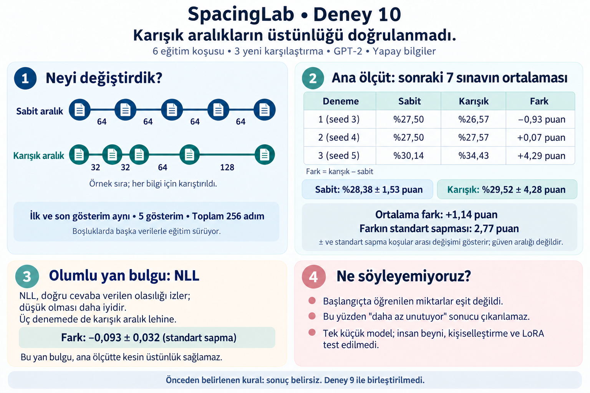

# SpacingLab — Deney 10 tamamlandı (9 Eylül 2026)

> **Sonraki kontrolün açıklaması:** Doğru cevapların yanında aynı türden yanlış
> cevaplar da ortalamada daha olası hâle geliyor. Doğruyu yanlıştan ayırma ölçüsü
> tutarlı iyileşmedi. Bu nedenle aşağıdaki olumlu NLL işaretini "daha güçlü bilgi
> hafızası" diye yorumlamıyoruz. Bu yeni bir eğitim değil, mevcut kayıtlardaki
> kontrol ölçüsünün açıklaması: [doğru/yanlış cevap karşılaştırması](results/study10/NLL_SPECIFICITY.md).

**Yeni üç karşılaştırma da karışık aralıkların kesin üstünlüğünü göstermedi;
ama doğru cevaba verilen olasılık açısından olumlu bir yan bulgu var.**

## Ne yaptık?

Küçük bir dil modeline aynı bilgileri beş kez gösterdik.
Bir grupta boşluklar 64–64–64–64, diğerinde 32–32–64–128'in karıştırılmış sırasıydı.
İlk ve son gösterim aynıydı; aralarda başka metinlerle eğitim sürdü.
Üç yeni rastgelelik ayarıyla iki yöntemi de yeniden çalıştırdık: altı eğitim tamamlandı.

## Ana sonuç: sonraki yedi sınavın ortalaması

| Karşılaştırma | Sabit | Karışık | Karışık yöntemin farkı |
|---|---:|---:|---:|
| 1 (seed 3) | %27,50 | %26,57 | -0,93 puan |
| 2 (seed 4) | %27,50 | %27,57 | +0,07 puan |
| 3 (seed 5) | %30,14 | %34,43 | +4,29 puan |

Sabit yöntem ortalaması %28,38; standart sapması 1,53 puan, aralık %27,50–30,14.
Karışık yöntem ortalaması %29,52; standart sapması 4,28 puan, aralık %26,57–34,43.
Eşleştirilmiş fark ortalama +1,14 puan; standart sapması 2,77 puan.
Standart sapma koşudan koşuya değişimi gösterir; güven aralığı değildir.

Birinde biraz geride, birinde neredeyse aynı, birinde önde. Bu nedenle önceden
belirlediğimiz kurala göre sonuç belirsiz. Bu, iki yöntemin kesin eşit olduğu
anlamına da gelmiyor.

## Olumlu yan bulgu: doğru cevabın olasılığı

NLL, modelin doğru cevaba ne kadar olasılık verdiğini izleyen hata ölçüsü;
düşük olması daha iyi. Üç denemede de karışık yöntemde daha düşüktü:
farklar -0,087, -0,065 ve -0,128; ortalama -0,093, standart sapma 0,032.

Örnek: doğru cevabın “Ankara” olduğunu düşün. Model hâlâ “İstanbul” diyebilir,
ama Ankara'ya verdiği olasılık yükselmiş olabilir. Doğru cevap sayısı tek başına
bu değişimi kaçırabilir. Bu örnek gerçek deney verisi değil, ölçü farkını açıklıyor.

Yalnızca son sınava bakınca da karışık yöntem lehine fark vardı:
ortalama +4,50 puan, standart sapma 2,00 puan; üç fark +2,50–6,50 puan.
Fakat baştan ana ölçüt olarak yedi sınavın ortalamasını seçmiştik.
Son sınavı veya NLL'yi sonradan ana sonuç yapıp “başardık” demiyoruz.

## Ne göstermiyor?

Başlangıçta öğrenilen miktarlar eşit değildi; dolayısıyla doğrudan “daha az
unutuyor” diyemeyiz. Tek küçük GPT-2 modeli ve yapay bilgilerle çalıştık.
İnsan beynindeki mekanizma, kişiselleştirme, LoRA veya genel becerilerin korunması
test edilmedi. Önceki Deney 9 ayrı tutuldu; sonuçları birleştirerek güçlü bir iddia üretmedik.

## Sırada ne mantıklı?

Bu dar soruda kesin üstünlük bulamadık. Olumlu NLL ve son sınav bulgularını yeni
verilerle, ölçütleri ve koşu sayısını baştan sabitleyerek ayrıca sınamak değerli
olabilir. Sırf olumlu sonuç çıksın diye aynı deneye koşu eklemek mantıklı değil.
Yeni eğitim başlatılmadı; mevcut altı koşu ve doğrulama kayıtları saklandı.

- [Tam sayısal rapor](results/study10/REPORT.md)
- [Kısa İngilizce değerlendirme](results/study10/WRITEUP.md)
- [Bağımsız sonuç kontrolü](results/study10/AUDIT.md)
- [Görsel üretim istemi](results/study10/INFOGRAPHIC_PROMPT.md)

Görsel imagegen ile üretildi; eksik gösterim içeren ilk taslak düzeltildi ve
son görsel sayısal raporla karşılaştırıldı. Çizgiler şematiktir; aralıkları
üzerlerindeki sayılar gösterir. Görsel ve üretim/düzeltme istemleri projede kayıtlı.
GitHub'a gönderim veya kişisel mesajlara erişim olmadı.
