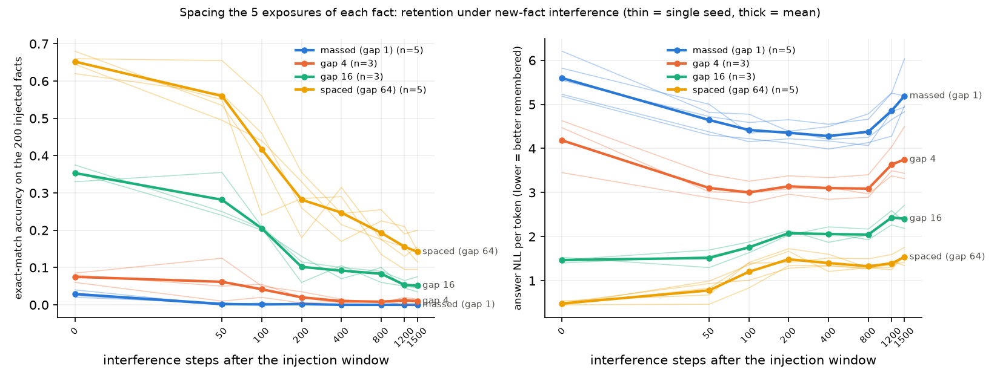
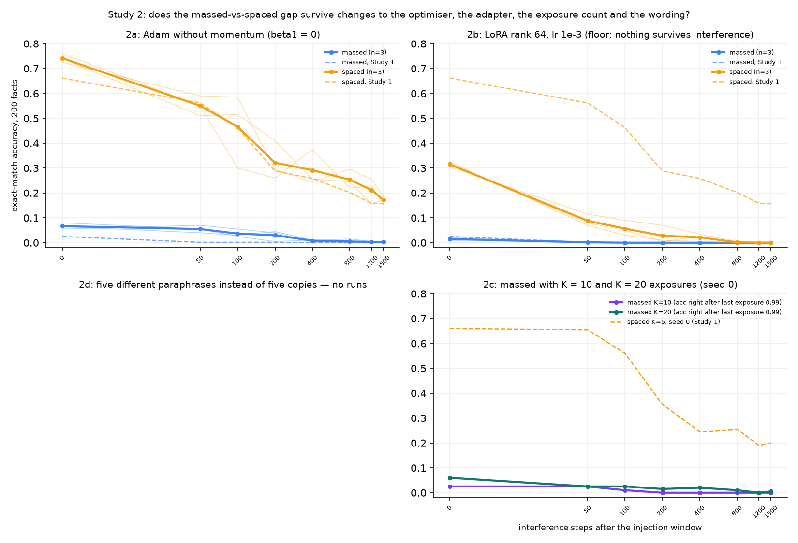

# SpacingLab: does spacing repetitions protect fine-tuned facts?

> **Current status (8 September): Study 7 completed; Study 8 now running.** Study 7's
> six fresh matched-data runs gave random minus spaced retention +0.09286, sample SD
> 0.04586, seed range +0.06357 to +0.14571; NLL also favored random. This is a total
> placement-policy effect, not a recency-controlled comparison.
> [Study 7 results](results/study7/REPORT.md). The user-authorized next control matches
> every fact's final exposure in six fresh runs: [Study 8 registration](docs/STUDY8_PREREGISTRATION.md).
> No Study 8 outcome yet. Check `RESUME.md` before launching any training command.

> **Status correction, 8 September 2026:** Study 6b reused a spaced control from
> before the filler cache grew. A registered provenance audit reproduces changed
> training/held-out streams for all three seeds and finds pre-intervention log
> differences. **The claim "ordinary shuffling suffices" is withdrawn pending a
> fresh matched-data comparison.** This does not invalidate all within-study results.
> [Current audit and limitations](docs/PROVENANCE_AUDIT_2026-09-08.md) ·
> [Kısa Türkçe durum](docs/DURUM_2026-09-08_TR.md).

**Question.** When a small language model is fine-tuned to absorb new facts, each shown
five times, does *spreading* the five exposures apart in training (other data in
between) protect the fact against later forgetting, compared with showing them in
five consecutive steps — everything else equal?

This borrows the **spacing effect** from human memory research, one of its most
replicated findings: the same number of study repetitions gives better long-term
retention when they are spread out than when they are massed.

**Answer (GPT-2 124M, synthetic facts, one protocol):** the pre-registered hypothesis was **not supported as written**. Study 1 found higher later exact-match accuracy with spaced repetition, but acquisition was unequal too. At each fact's fifth exposure, massed accuracy averaged 43% (seed range 26–64%) versus spaced 81% (78–85%). At window end these were 3% (2–4%) and 65% (62–68%). These observations do not isolate slower forgetting after equal learning, and loss of correct output is not proof of erasing an internal representation. Full paired results and failed decision rules are retained below.

The design, prediction, decision rule and named traps were committed before any
number existed ([PREREGISTRATION.md](PREREGISTRATION.md)); the four amendments made
during calibration are recorded there with the pilot numbers that forced them.

## Setup in one paragraph

GPT-2 (124M), full fine-tuning on Apple-Silicon MPS, AdamW lr 1e-4, dropout off.
200 synthetic paired-associate facts per seed ("The capital of Sheipiakvuk is
Prothkunshend.") with invented names, so the pretrained model scores exactly 0 on
them. Each fact is shown 5 times inside a 700-step "injection window" on top of a
fixed WikiText-103 filler stream (15 chunks of 64 tokens per step). The only thing
that differs between conditions is the *gap* between a fact's five exposures:
1 step (massed), 4, 16, or 64 steps (spaced). Each fact's **last** exposure step is
drawn once per seed and shared by all conditions, so time-since-last-exposure is
identical across conditions. After the window come 1500 steps of interference:
filler plus 50 *new* facts of the same kind (the classic learn-A-then-B paradigm).
Retention is measured as exact-match accuracy (and answer NLL) at 7 checkpoints.
Five seeds for massed vs spaced, three for the intermediate gaps, one replicate run
to check repeatability (one repeat cannot estimate a noise distribution). The audit inventories 73 main logs, including that repeat and two single-seed contingency runs, plus 12 preserved pilot logs. These are not 73 independent replications.


## Study 1: the pre-registered comparison



*Left: exact-match accuracy on the 200 injected facts at the end of the injection window
(step 0) and at the seven interference checkpoints. Right: answer NLL (lower = better
remembered). Thin lines are single seeds, thick lines the mean.*

### Numbers (mean over seeds, min..max in brackets)

| condition (gap) | seeds | immediate acc | retention score | acc at step 1500 | acc right after last exposure |
|---|---|---|---|---|---|
| massed (1)  | 5 | 0.03 (0.02..0.04) | 0.001 (0.000..0.001) | 0.00 | 0.43 (0.26..0.64) |
| gap 4       | 3 | 0.08 (0.06..0.09) | 0.023 (0.008..0.038) | 0.01 | 0.94 (0.92..0.95) |
| gap 16      | 3 | 0.35 (0.33..0.38) | 0.124 (0.111..0.144) | 0.05 (0.04..0.08) | 0.96 (0.94..0.99) |
| spaced (64) | 5 | 0.65 (0.62..0.68) | 0.285 (0.241..0.351) | 0.14 (0.10..0.20) | 0.81 (0.78..0.85) |

*Retention score* = mean exact-match accuracy over the seven interference checkpoints
(the pre-registered primary outcome). Paired spaced − massed retention difference:
+0.29, seed-to-seed SD 0.04, positive in every one of the five seeds (range
+0.24..+0.35). One repeated run differed by 0.014 in retention and 0.000 in immediate accuracy. Historical decision rules used this as a noise band, but one pair cannot calibrate such a band.
Retention is monotone in the gap in every seed where all four gaps were run.

**Guards.** Within a seed, every condition took the same 2,300 optimizer steps, saw the
same 2,208,000 filler tokens and the same 18.5–18.9k fact tokens; pre-injection
accuracy was exactly 0 in all 17 runs; weight displacement after the window was
79.5–81.1 in every condition (no condition "moved more"); held-out filler loss at the
end was 3.37–3.45 everywhere, so the interference phase trained equally.

### The pre-registered decision rule, applied

| rule | result |
|---|---|
| 1. spaced > massed retention in every seed | **yes** (5/5) |
| 2. mean Δ exceeds seed SD and noise band | **yes** (0.29 vs 0.04 and 0.014) |
| 3. immediate difference smaller than retention difference | **no** (+0.62 vs +0.29) |

So **H1 is not supported as pre-registered.** Rule 3 was written to catch the boring
explanation "spaced simply learned more". It fired. Reporting that first is the point of
writing the rule down beforehand.

**Calibration failure, as Amendment 2 requires it to be called.** Amendment 2 committed
to checking the immediate-accuracy band [0.5, 0.95] in the main runs and to reporting a
violation as a calibration failure rather than repairing it. Three of the four conditions
violate it: massed 0.03, gap 4 0.08, gap 16 0.35. Only spaced (0.65) is inside the band.
Nothing was re-tuned; the runs stand as they are, and the floor in the massed condition
is the reason the pre-registered framing could not be tested. The Amendment 4 probe below
was added *before* the main runs to make that floor interpretable, not after.

### What rule 3 actually caught (Amendment 4, measurement added before the main runs)

The pre-registered "immediate" probe sits at a fixed step, up to 444 steps after a
fact's last exposure, inside a window that is itself dense with interference (the other
199 facts). A low immediate score can therefore mean *never encoded* or *encoded and lost
inside the window*. Amendment 4 added a probe of each fact right after the optimizer step
of its own last exposure. That probe separates the two:

- massed facts **are** encoded: 43 % exact-match right after the fifth consecutive step
  (NLL 1.1), against 81 % for spaced and 94–96 % for gaps 4 and 16;
- and they **do not last**. Take only the facts that were correct at that moment. At the
  end of the window, 6 % of them are still correct for massed vs 77 % for spaced. Averaged
  over the seven interference checkpoints that follow, 0.2 % vs 33 %.

Exploratory, pooled over seeds: split facts by how long they waited between their last
exposure and the end-of-window probe. Massed facts that waited under 50 steps survive at
24 %; over 50 steps, 0 %. Spaced facts survive at 100 %, 99 %, 92 %, 63 % and 20 % for
waits of 0–50, 50–100, 100–200, 200–300 and 300–450 steps. Restricting to *strongly*
encoded facts (NLL < 0.1 right after the last exposure) changes nothing for massed:
9.5 % survive to the end of the window, against 93 % for spaced.

What the massed model says instead is telling: it produces invented-looking names of the
right kind ("Zusvrox", "Prairhenv") but not the associated one. It learned the *format*
of the facts and lost the *item*.

**Honest summary of Study 1.** The pre-registered framing ("equal encoding, then who
keeps more") could not be tested, because consecutive exposures never produce a memory
that survives to the first probe. The finding that replaced it is stronger and simpler:
the *same* five gradient steps on the *same* sequence produce a durable memory when
spread out and a memory with a half-life of tens of steps when consecutive, with total
steps, tokens, filler, and time-since-last-exposure held fixed. gap 4 is almost as bad as
gap 1; gap 16 is half-way; gap 64 is the best we tested (we did not test larger gaps,
so we do not know where the benefit stops).


## Study 2: four follow-ups, pre-registered in Amendment 5 (2a, 2b, 2d before their runs; 2c's prediction was written while its first run was already going)



*Solid = Study 2 runs (thin: seeds, thick: mean). Dashed = the matching Study 1 curves.*

| sub-study | question | prediction (written first) | result | verdict |
|---|---|---|---|---|
| **2c** massed with K = 10, 20 (seed 0) | can more consecutive repeats reach spaced's immediate level? | no: stays < 0.30 | acc right after last exposure 0.99 / 0.995; end of window **0.025 / 0.06**; retention 0.005 / 0.014 | prediction held; a learning-matched massed control is not reachable this way |
| **2a** Adam with beta1 = 0 (3 seeds) | is momentum the mechanism? | penalty persists | spaced − massed retention **+0.30** (seeds +0.33, +0.28, +0.30; Study 1: +0.29). massed now encodes 0.95–0.98 right after the last exposure (was 0.43) and still ends the window at 0.06–0.08 | Adam's first-moment momentum is **not required** for the gap (β₂ untested); β₁ only weakened massed *encoding* |
| **2b** LoRA (3 seeds) | does it hold for adapters? | same direction | calibration failed: ranks 16/64, lr 3e-4..1e-2, best immediate 0.245. At rank 64 / lr 1e-3: end-of-window **0.31 vs 0.015** in every seed, but both reach **0.00** by interference step 800–1500; retention Δ +0.03 (SD 0.015, noise 0.014) | rules 1–2 pass formally, by two hundredths; the ordering replicates at the end of the window, but the retention comparison is a **floor effect** and no size is read |
| **2d** five paraphrases instead of five copies (3 seeds) | does wording diversity substitute for spacing? | partial substitution | massed+para − massed = **+0.002**; spaced+para − spaced = **−0.20** (every seed). Right after its 5th exposure a massed+para fact is correct in the canonical form only 0.5–2.5 % of the time | prediction **failed**; no substitution, not additive. Confounded: the probe uses the canonical sentence, seen once in this condition (see below) |

**2c in words.** Twenty consecutive exposures push the fact to 99.5 % right after the
last step and it is at 6 % by the end of the window. The pre-registered contingency
("raise K until massed matches spaced immediately") cannot be executed because no number of
consecutive repeats produces a memory that survives to the probe. That is itself the
finding: the problem with massed exposures is not how much they teach, it is how long
it lasts.

**2a in words.** Turning off Adam's first moment changes absolute levels a little
(both conditions encode more) and the paired gap not at all. Under Adam the *normalised*
step for five identical consecutive gradients is the same with or without momentum, so
this was the expected outcome, but the "it's just momentum overshoot" objection needed a
measurement, not an argument. It also corrects something I wrote earlier in this run:
massed's weak at-last encoding in Study 1 (0.43) *was* a momentum artefact; the decay was
not.

**2b in words.** LoRA at every setting we tried holds these 200 facts poorly: even
random placement (the pilot) peaks at 0.25 immediate and 0.00 after 400 interference
steps. At the best setting, massed still ends the window near zero (0.01–0.02) and spaced
at 0.31 in all three seeds, so the direction is the same as in full fine-tuning. Nothing
survives 1,500 interference steps in either condition, so the retention score cannot
separate them. We report the ordering, not a size. Weight displacement is *larger* for
massed under LoRA (89.7 vs 78.1), the opposite of "spaced moved more".

**2d in words.** This one died. Five different sentences in five consecutive steps leave
the canonical form at 0.5–2.5 % right after the fifth step, so there is nothing to
retain. Spaced paraphrases lose about 20 points against spaced copies on the canonical
probe, and NLL goes the same way (+0.79). Two readings, and the design cannot separate
them: (i) with one exposure per wording, the model does not merge the five wordings into
one fact retrievable from any of them; (ii) the probe is unfair to paraphrase conditions
because their eval sentence was seen once instead of five times. Study 4 below ran the fair
probe and settled it: reading (ii).

**Guards, Study 2.** Steps and filler tokens identical to Study 1 within seed; fact
tokens identical for 2a/2b, +2.9 % for 2d (paraphrases are slightly longer), 1.8× / 3.5×
for 2c by design. Pre-injection accuracy 0 in all 20 Study 2 runs. Held-out filler loss
at the end 3.37–3.43 for 2a/2d (same as Study 1), 3.56–3.63 for LoRA.


## Study 3: is the massed memory erased, or only hidden? (Amendment 6, pre-registered)

Two fair objections to reading exact-match accuracy: NLL on the true answer falls for
massed too (8.5 → 5.0), so *something* is retained; and a memory can vanish at the output
while a trace remains in the weights. Two measurements were added, each with a control
that cancels the obvious confound, and six runs (massed vs spaced, seeds 0–2) were made.

**Discrimination** = NLL(foil answer) − NLL(true answer), the foil being another fact's
invented name from the same template. Format learning affects both equally and cancels.
Sanity check passed: the pretrained model scores +0.05, i.e. no preference.

**Savings** (Ebbinghaus): after interference, every old fact and every one of 200
never-seen control facts is shown exactly once; both sets are then probed.

| | massed (3 seeds) | spaced (3 seeds) |
|---|---|---|
| discrimination at end of window | +0.19 .. +0.25 | +2.67 .. +3.03 |
| discrimination after 1,500 interference steps | **+0.24 .. +0.46** | **+2.06 .. +2.60** |
| share of facts where true answer beats foil | 54–60 % | 91–95 % |
| accuracy gain from one re-exposure, old facts | **0.000, 0.000, −0.005** | **+0.105, +0.240, +0.200** |
| same for never-seen controls | 0.000 | 0.000 |
| NLL of old facts after one re-exposure vs controls | 3.8–4.1 vs 5.7 | 1.2–1.5 vs 5.7 |

**Reading, corrected 8 September.** Prediction 1 held: massed discrimination is above
zero in every seed, and below spaced. Prediction 2 **failed** under the registered
one-re-exposure test. However, both massed and unseen controls are at the accuracy
floor; this does not establish absence of savings or unusability of the remaining
trace. Spaced old facts improve by 10.5–24 percentage points, but their starting
accuracy differs from controls, so this is not a clean savings estimate. The old
"90% format, not knowledge" claim is withdrawn: one chosen foil does not identify
that causal decomposition. Multiple re-exposure budgets and continuous measures
would be needed to assess relearning sensitivity.

One oddity for the record: for spaced facts the single re-exposure raised accuracy but
*lowered* discrimination (2.6 → 1.6). The relearning batch also contained 20 unseen
facts per step, which pull the format prior toward "any invented name"; accuracy and the
foil-relative margin can move in opposite directions under that pressure. Not
investigated further.

## Study 4: the fair paraphrase probe (Amendment 7, pre-registered)

Study 2d's probe was the canonical sentence, which copy conditions saw five times and
paraphrase conditions once. Study 4 re-ran all four conditions (seeds 0–2, 12 runs) with
an added probe through a **sixth wording no condition ever saw**. Training is unchanged;
the canonical-probe numbers replicate Study 1 and 2d on the same seeds to within 0.01 (a third replication).

| retention, mean of 3 seeds | canonical probe | unseen-wording probe | discrimination, unseen |
|---|---|---|---|
| massed | 0.002 | 0.001 | +0.18 |
| massed + paraphrases | 0.002 | 0.002 | +0.29 |
| spaced (5 copies) | **0.306** | 0.060 | +1.13 |
| spaced + paraphrases | 0.092 | **0.108** | +1.34 |

End-of-window accuracy tells the same story more sharply: five copies give 0.667 on the
trained sentence and 0.275 on the unseen one (a 40-point drop); five paraphrases give
0.348 and 0.365 (no drop at all; prediction 1, "everyone scores lower on the unseen
wording", failed for this condition).

**Pre-registered rule.** spaced+para − spaced on unseen-wording retention: +0.056,
+0.043, +0.044, all above the 0.041 spread, so the rule calls it **"diversity buys
generalisation"**. The margins are two to fifteen thousandths above the threshold, and I
would not have believed the call on retention alone. What makes it credible is that the
same ordering holds at the end of the window by a wider margin (+0.055, +0.080, +0.135)
and in discrimination (+0.27, +0.18, +0.18). massed+para stays at zero (prediction 3).

**What this corrects.** Study 2d's reading (i) was wrong and reading (ii) was right: the
paraphrase penalty was the probe, not the model. The honest summary of both studies is a
trade, not a loss: **copies help the trained wording; paraphrases help the tested
unseen wording.** This is one held-out wording per relation, not proof of wording-
independent factual knowledge. Neither wording condition rescues massed accuracy
in this protocol.

## Study 5: where does the benefit stop? (Amendment 8, pre-registered; 15 runs)

Window doubled to 1,400 steps so gaps of 128 and 256 fit; all gaps re-run in that window
(seeds 0–2).

| retention score | gap 1 | gap 16 | gap 64 | gap 128 | gap 256 |
|---|---|---|---|---|---|
| seed 0 | 0.004 | 0.171 | **0.366** | 0.280 | 0.296 |
| seed 1 | 0.000 | 0.108 | 0.194 | **0.274** | 0.222 |
| seed 2 | 0.002 | 0.104 | **0.224** | 0.161 | 0.175 |
| mean | 0.002 | 0.128 | **0.261** | 0.238 | 0.231 |

**Reading.** The rising limb 1 < 16 < 64 replicates in every seed (prediction 1).
Prediction 2, "128 beats 64", **failed**: 128 is below 64 in two of three seeds
(−0.086, −0.063) and above in one (+0.080). Beyond 64 the curve is a plateau whose
seed-to-seed wobble (gap 64 alone spans 0.19–0.37) is larger than any gap-to-gap
difference. The pre-registered rule for 256 vs 128 (+0.016, −0.051, +0.014; two of three
inside the 0.041 spread) returns **"saturates"**. Prediction 3 (diminishing returns in
every seed) also failed: in seed 1 the 64 → 128 change was positive, followed by a
negative 128 → 256 change; in seeds 0 and 2, a negative change was followed by a
positive one. These are not monotone diminishing increments.
Encoding right after the last exposure also weakens at large gaps (gap 64: 0.84 → gap 128:
0.61 → gap 256: 0.58 in seed 0): when the earlier exposures are hundreds of steps back,
the fifth one has less to build on. That is the shape of the human lag effect (Cepeda et
al. 2008), where too much spacing stops helping because each repetition no longer finds
the previous trace. Scope: one window length, one interference length; the human result
says the optimum moves with the retention interval, which we did not vary.

**Practical restatement.** Larger tested gaps did not consistently improve retention
over 64 in these three seeds. This does not establish equivalence or a universal
optimal gap.

## Study 6: two checks the external review asked for (Amendment 9, pre-registered)

An outside review (ChatGPT Pro, filed in `docs/external_review_chatgpt_pro_2026-09-07.md`)
raised two objections worth answering before anything else.

**6a. Did only the gap change?** The per-step loss is a mean over sequences (15 filler
plus n facts), so one fact exposure weighs 1/(15 + n) in its step. Massed exposures
cluster, so n is larger when facts are present. Reconstructed from every schedule
(`spacinglab.audit`, no training):

| Study 1 window | steps with facts | facts/step when present | max facts/step | mean weight per exposure |
|---|---|---|---|---|
| massed | 403 | 2.48 | 9 | 0.0553 |
| gap 4 | 406 | 2.46 | 8 | 0.0554 |
| gap 16 | 428 | 2.34 | 9 | 0.0556 |
| spaced | 504 | 1.98 | 8 | 0.0569 |
| random | 538 | 1.86 | 7 | 0.0577 |

Massed exposures carry **2.8 % less** loss weight than spaced ones (3.0 % in the Study 5
window). It falls inside the pre-declared 5% operational threshold, but that threshold
does not establish equivalence. Extra-exposure controls do not bound this confound's
causal effect: optimization is not linear in repetition count. Gradient-clip ratios
were not logged and cannot be reconstructed. Interpret the comparison as a total
schedule-policy effect, not an isolated gap-only mechanism.

**6b. Does ordinary shuffling already give you this?** Condition `random`: each fact's
five exposures at five uniformly random steps of the window, seeds 0–2, with nominal
settings from Study 1. This synthetic placement is not a literal epoch-wise data
shuffle, and it is deliberately *not* last-exposure-matched. The 8 September audit
found that the intended filler-stream matching cannot be sustained.

| seeds 0–2 | immediate | retention score | acc at step 1500 |
|---|---|---|---|
| massed | 0.03 | 0.001 | 0.00 |
| spaced (gap 64) | 0.66 | 0.298 (0.351, 0.266, 0.277) | 0.16 |
| random | 0.75 | **0.360** (0.439, 0.292, 0.347) | 0.23 |

random − spaced = +0.088, +0.026, +0.070 (mean +0.061, sample SD 0.032). The historical
decision rule labeled this "ordinary shuffling suffices". **That interpretation is
withdrawn:** the comparison reused an old control, and both input-stream reconstruction
and pre-intervention logs now indicate a matching problem. These numbers remain
descriptive, not an isolated placement effect. Recency, variable gaps, and batch
composition also differ by design; neither equivalence nor a real-world shuffle
recommendation follows from this comparison.


## What is usable from this

The robust engineering lesson from the audit is to freeze and fingerprint the actual
training and held-out streams, rather than equating equal seeds or token counts with
equal data. Within this GPT-2 synthetic-fact protocol, clustered repetition performed
poorly and spaced repetition warrants further testing. We do not yet have a validated
shuffle replacement, universal minimum gap, or evidence for a brain-like mechanism.

## What I would test next, and whether it is worth it

First rerun both random and spaced conditions freshly in three pairs, with immutable
data/model/software provenance and acquisition, NLL, batch-weight and clipping guards.
Do not reuse historical spaced controls. This estimates a total placement-policy
effect, not equal-acquisition forgetting. Three seeds screen direction, not equivalence.

Worth continuing: yes, at this bounded comparison. A calibrated multi-budget savings
test and a second small model are later steps. Mechanism work and publication should
not outrun validation of the practical baseline.

## What this does not show

One model (GPT-2 124M), one fact format (single-sentence synthetic paired associates),
one filler and interference corpus (WikiText-103), one learning rate, K = 5, gaps up to
64 steps of a 700-step window. Nothing here speaks to larger models, real-world facts,
or other interference domains. The mechanism story (why consecutive identical steps leave
a fragile trace) is a hypothesis; Study 2a tests one piece of it and no more.

Prior work (see [docs/literature.md](docs/literature.md)) has studied duplication vs
paraphrase and corpus-level repetition, and Chang et al. (2024) report that duplicated
injections forget faster than paraphrased ones; we found no earlier measurement that
varies only the gap between repeats of one fact with everything else matched.


## How to reproduce

```bash
uv sync
uv run pytest
scripts/main_runs.sh            # 17 runs, ~2.7 h on an M-series laptop
uv run python -m spacinglab.analyze   # Study 1 pre-registered analysis
uv run python -m spacinglab.explore   # Study 1 exploratory analyses
uv run python -m spacinglab.plot      # results/retention.png
scripts/study2_runs.sh scripts/study2b_runs.sh scripts/study2d_runs.sh   # Study 2 (~3.5 h)
uv run python -m spacinglab.analyze2  # Study 2 paired analysis, Amendment 5 rules
uv run python -m spacinglab.plot2     # results/study2.png
scripts/study3_runs.sh && uv run python -m spacinglab.analyze3   # Study 3 (~1 h)
scripts/study4_runs.sh && uv run python -m spacinglab.analyze4   # Study 4 (~2 h)
scripts/study5_runs.sh && uv run python -m spacinglab.analyze5   # Study 5 (~3 h, resumable)
uv run python -m spacinglab.audit                                 # Study 6a (no training)
scripts/study6_runs.sh                                            # Study 6b (3 runs, ~30 min)
```

Pilot logs: `results/pilot*.log`. Main-run logs (per-fact evaluations, generated
answers, guards): `results/runs/*/log.json`.
